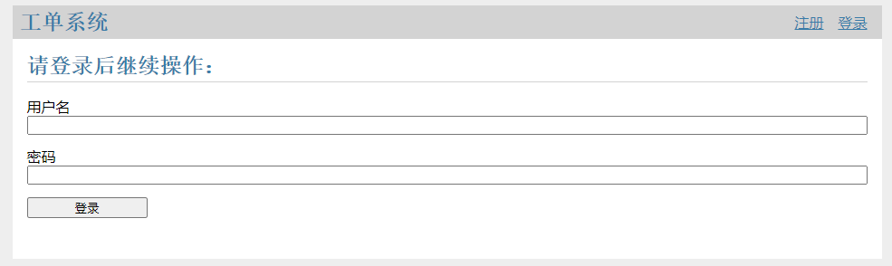
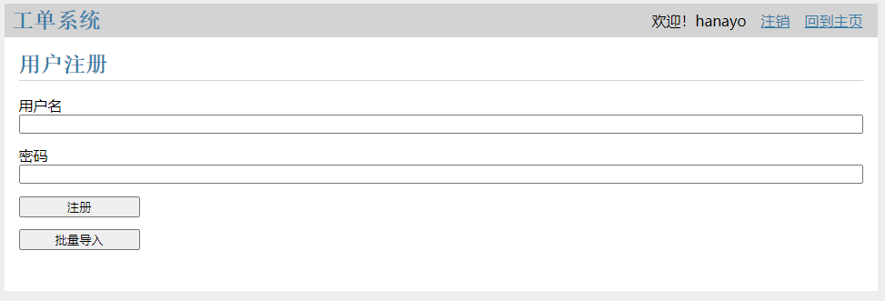
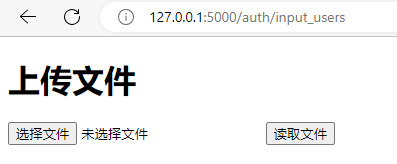
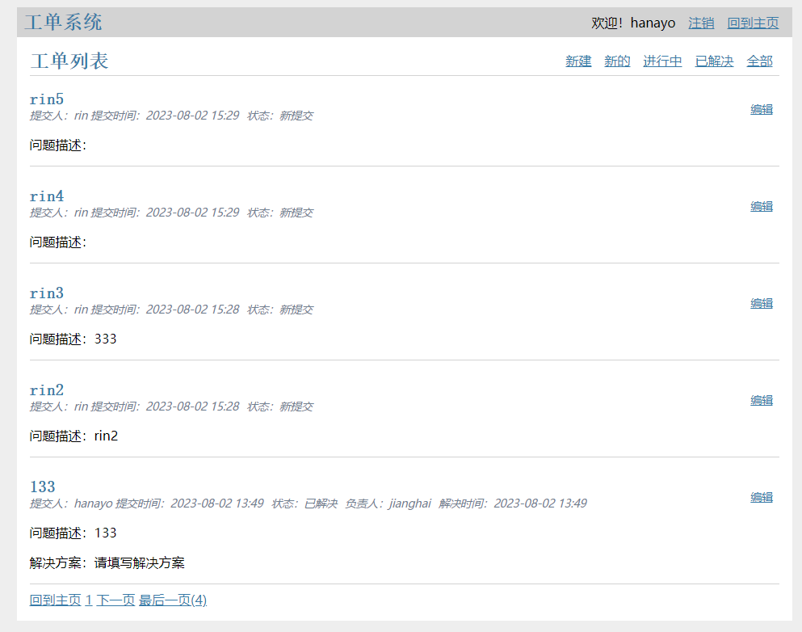
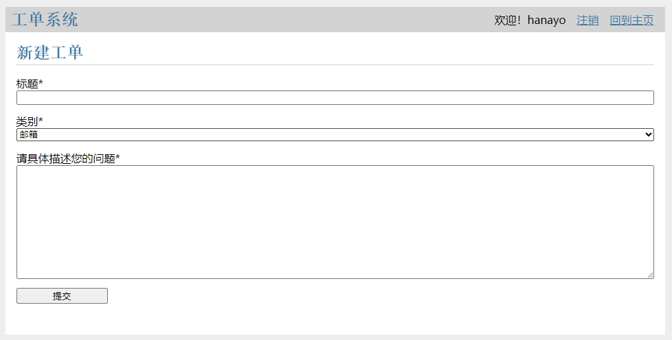
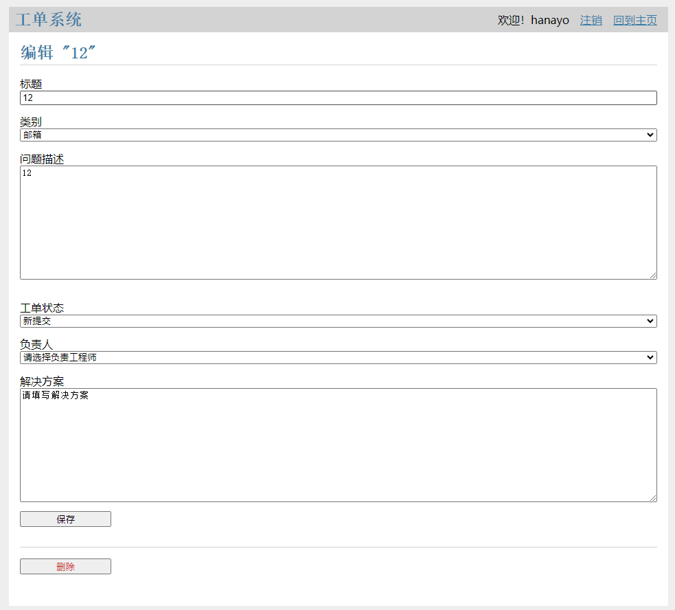
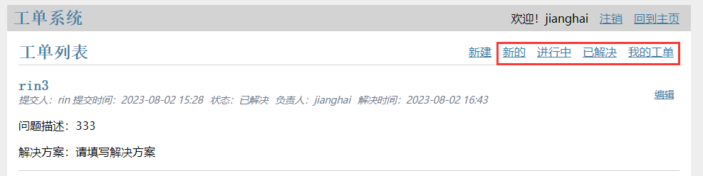

# hanayo_flask
一个基于flask框架示例程序，改造而成的工单系统
### 功能列表

主要实现了以下功能：

| 功能名称 | 权限 | 备注 |
| --- | --- | --- |
| 用户登录、注销 | all |  |
| 用户注册 | admin |  |
| 批量导入用户 | admin | 通过csv导入 |
| 查看工单 | all | 管理员可以查看所有工单，用户仅查看自己的工单 |
| 提交工单 | all |  |
| 处理工单 | admin |  |
| 工单筛选 | admin | 便于管理员处理工单 |

### 数据库设计

使用sqlite数据库，小巧便捷。

1. post表用来保存工单信息，各字段如下：
    
    
    | 字段名 | 数据类型 | 含义 |
    | --- | --- | --- |
    | id | 自增加，int | 工单id，主键 |
    | author_id | int | 作者id，外键 |
    | created | date | 创建时间 |
    | title | text | 工单标题 |
    | body | text | 具体问题描述 |
    | category | text | 问题分类（下拉菜单 |
    | status | text | 工单状态（下拉菜单 |
    | solution | text | 解决方案 |
    | owner | text | 工单负责人 |
    | done | date | 解决时间 |
2. user表用来存储用户信息，各字段如下：
    
    
    | 字段名 | 数据类型 | 含义 |
    | --- | --- | --- |
    | id | 自增加，int | 主键，用户id唯一标识 |
    | username | txt |  |
    | password | hash加密的txt |  |

## 具体功能介绍

### 1.用户登录和注销

http://127.0.0.1:5000/auth/login

### 2.用户注册

http://127.0.0.1:5000/auth/register

> 该页面只有管理员可以访问，作用是用来新建单个用户。为了方便测试，目前是所有人可以注册的，如需开启管理员访问，请取消auth.py中23行开始的注释
> 

### 3.批量导入用户

http://127.0.0.1:5000/auth/input_users

> 该页面只有管理员可以访问，作用是用来批量创建用户
> 

csv文件包含两列，第一列是用户名，第二列是密码，不含标题。例如

| jianghai | 6xJvmmh4 |
| --- | --- |

### 4.查看工单、新建工单

http://127.0.0.1:5000/

登录后可以查看工单，默认每页显示5条，可以进行翻页

查看工单页面，具体功能如下：

1. 一般用户只能看到自己提交的工单，管理员可以看到所有工单
2. 管理员可以对工单进行筛选，通过点击右上角的新的、进行中、已解决，分别筛选不同状态的工单进行显示
3. 点击右上角的新建按钮，可以进入工单新建页面

### 5.提交工单

通过点击工单查看页面的新建按钮，来进入新建工单界面

> 用户仅需填写标题、选择类别以及描述问题。让用户填写的内容尽量少，来提高用户体验。
> 

### 6.工单处理

管理员可以点击编辑，进入工单处理界面

管理员可以进行如下操作：

1. 选择负责人，这代表谁将会处理这个工单。用户可以在他的界面看到谁负责这个工单。
2. 工单解决后，应填写解决方案。解决方案填写后同样会显示在主界面，方便用户查看。
3. 更新工单状态。如果选择了负责人，工单状态会自动变为进行中；如果更新状态为完成，则会更新工单完成时间。
4. 管理员可以删除提交错误的工单

### 7.工单筛选

如果工单较多，管理员在处理时可能不太方便。此时可以点击右上角进行筛选：

各状态的含义如下：

1. 新的：用户新提交的，还没人认领的工单
2. 进行中：已经分配了工程师，正在处理的工单
3. 已解决：已处理完毕的工单
4. 我的工单：状态是分配中，负责人是当前登录用户的工单
